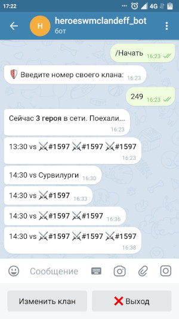

## Телеграм бот для игры "Герои войны и денег"

Бот отслеживает нападения сурвилургов/кланов на предприятия и оповещает в рассылке. 
Есть возможность изменить клан для отслеживания или выйти в начало меню.

Любой желающий может использовать данный код и модифицировать для своего клана.

## Программная реализация:
Бот написан на языке **Python3**

Python для Windows можно скачать [здесь >>](https://www.python.org/downloads/windows/)

Python для Linux можно прописать команду `#apt install python3`

Необходимо установить следующие библиотеки для Python:

`#pip3 install pyTelegramBotAPI bs4 requests`

## Описание программы:

**def_db.py** - отвечает за сбор информации с 
[www.heroeswm.ru/mapwars.php](https://www.heroeswm.ru/mapwars.php)
и добавляет как словарь в файл **_db.txt_**

**bot_def_clan.py** - обрабатывает запросы пользователей по отслеживаемым предприятиям
и делает рассылку в случае обнаружения нужного предприятия из файла **_db.txt_** 

p.s. Можно было всю программную логику поместить в один файл, но для отладки так удобнее...

## Настройка своего бота:

1. Нужно вставить Ваш собственный TOKEN телеграм бота в файл **_bot_def_clan.py_** строка 9.

Пример как должно быть:

`bot = telebot.TeleBot('1515876054:HHGrOiE9L8ahL4UiGvQngMeAILxWRthjK')`

Информацию как получить TOKEN можно прочитать [здесь >>](https://info-effect.ru/token-bota-v-telegramm-kak-uznat.html)

2. Нужно прописать логин и пароль от персонажа в файле **_def_db.py_** (можно завести персонажа 1 уровня для этих целей):

- в 14 строчке кода прописываем логин (логин должен быть в кавычках)

- в 15 строчке кода прописываем пароль (пароль должен быть в кавычках)

## Запуск своего бота:

1. `#python3 def_db.py`

2. `#python3 bot_def_clan.py`

## Ваши предложения:

Если есть предложения по улучшению бота или разработки новых, пишите мне на почту: **_heroeswm.telegram.bot@gmail.com_**

Мой сайт: [https://heroeswm-telegram-bot.ru/](https://heroeswm-telegram-bot.ru/)

Проверить бота можно здесь **[https://t.me/BotClanDeff_bot](https://t.me/BotClanDeff_bot)**

